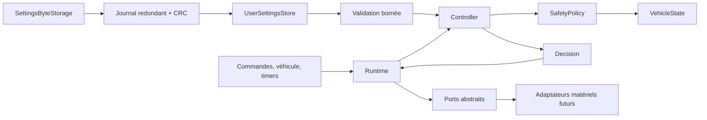
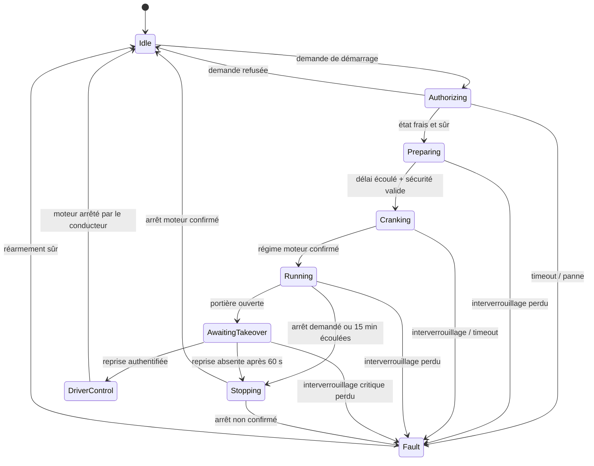
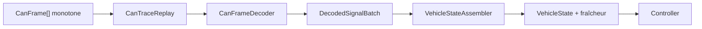

# Architecture logicielle

## Objectif du premier jalon

Le premier jalon fournit un noyau de décision complet, compilable sur ordinateur
et microcontrôleur. Il ne suppose aucun protocole BMW et ne commande aucun
matériel réel. Il sait reconnaître une séquence abstraite de trois impulsions de
verrouillage, mais leur acquisition BMW appartient au futur adaptateur. Cette
limite permet de vérifier les décisions avant de sélectionner un transceiver ou
une topologie électrique.

## Règle de dépendance

- **Domaine** : valeurs observées, signaux sémantiques, profils, transmission et rapport.
- **Application** : politique de sécurité, machine d'état, événements et actions.
- **Infrastructure** : exécution des actions au travers de ports abstraits.
- **Simulation** : décodeur synthétique et génération de scénarios hors véhicule.
- **Firmware** : assemblage spécifique à la carte. La version actuelle est
  inerte.

Le domaine et l'application ne dépendent d'aucun framework embarqué.

Les profils décrivent les variantes de véhicule et le niveau de preuve de chaque
signal sans contenir de détail CAN. Un garde d'application distinct empêche un
profil de découverte d'autoriser une fonctionnalité réelle. Voir
[vehicle-profiles.md](vehicle-profiles.md).

La source du signal de capot est une capacité du profil. Elle peut être absente,
provenir d'un signal véhicule validé ou d'une entrée discrète indépendante. Le
modèle reste identique dans tous les cas (`HoodClosed`) ; seul l'adaptateur
d'infrastructure change. Par défaut une source absente provoque un refus. Une
installation peut explicitement désactiver ce contrôle avec
`SafetyPolicyConfig::requireHoodClosed = false`.

`UserSettings` contient uniquement les préférences exposées à l'utilisateur.
`makeUserConfiguration()` les valide puis produit les configurations effectives
du contrôleur et du détecteur de verrouillages. Un échec de validation laisse le
démarrage distant désactivé. Le format de fichier PC et la future mémoire du
boîtier restent des adaptateurs d'infrastructure.

La persistance concrète est séparée en deux niveaux. `SettingsByteStorage`
abstrait une mémoire adressable et son commit ; `JournaledUserSettingsStore`
encode deux générations versionnées avec CRC, sélectionne la plus récente valide
et fournit un retour fail-safe si aucune ne peut être chargée. Voir
[settings-persistence.md](settings-persistence.md).

`ControllerConfig` exige un pointeur vers le profil sélectionné. Sans profil ou
avec un profil non qualifié, `RemoteStartRequested` reste en `Idle`, demande la
sécurisation des sorties et n'interroge pas le véhicule. Le profil synthétique
qualifié reste limité aux tests et au simulateur.

## Modèle des signaux

Chaque donnée du véhicule est un `Observed<T>` portant une valeur et une qualité :

- `Fresh` : utilisable pour une décision ;
- `Stale` : trop ancienne ;
- `Unavailable` : non reçue ou invalide.

La politique applique une règle fermée par défaut : `Stale` et `Unavailable`
sont toutes deux non sûres. Le calcul de fraîcheur appartient au futur adaptateur
véhicule, car il dépend de la cadence réelle de chaque message.

## Machine d'état

### États

| État | Responsabilité |
|---|---|
| `Idle` | Sorties au repos, attente d'une demande. |
| `Authorizing` | Demande d'un état véhicule frais et évaluation. |
| `Preparing` | Activation abstraite de l'allumage et délai contrôlé. |
| `Cranking` | Commande abstraite du démarreur avec durée maximale. |
| `Running` | Session distante surveillée et limitée dans le temps. |
| `AwaitingTakeover` | Portière ouverte, attente bornée d'une reprise authentifiée. |
| `DriverControl` | Commande distante libérée, conduite sous contrôle du conducteur. |
| `Stopping` | Mise en sécurité des sorties et attente de confirmation. |
| `Fault` | Défaut mémorisé, sorties sécurisées, réarmement contrôlé. |

## Événements et décisions

`Controller::handle()` consomme exactement un événement et le dernier état du
véhicule. Il retourne une `Decision` contenant :

- l'ancien et le nouvel état ;
- le défaut courant ;
- l'évaluation de sécurité ;
- au maximum huit actions ordonnées.

La capacité fixe empêche une allocation mémoire imprévisible. Les actions sont
des intentions telles que `RequestVehicleState`, `EngageStarter`,
`ReleaseRemoteControl`, `SecureOutputs` ou `ArmTimer` ; elles ne contiennent
aucune broche ou trame réseau.

## Exécution fail-safe

`Runtime` exécute les actions via quatre ports :

- `VehicleGateway` ;
- `ActuatorPort` ;
- `TimerPort` ;
- `NotificationSink`.

Si une opération véhicule, actionneur ou minuterie échoue, le runtime injecte un
événement `InfrastructureFailure`. Le contrôleur passe en `Fault` et ordonne
l'annulation du timer, le relâchement du démarreur et la sécurisation globale des
sorties. Le runtime retente ces seules actions de mise en sécurité sans boucle de
récursion.

## Chaîne de rejeu CAN

Le décodeur produit au maximum dix signaux dans un lot fixe. L'assembleur valide
le lot complet avant de l'appliquer : une valeur invalide ne peut donc pas laisser
un instantané partiellement mis à jour. Les trames inconnues sont comptabilisées
et ignorées ; une trame reconnue mais mal formée interrompt le rejeu.

`ReplayVehicleGateway` adapte cette chaîne au port `VehicleGateway`. Le protocole
fourni dans `simulation` utilise des identifiants étendus synthétiques et une
signature dédiée. Il n'encode aucune connaissance BMW.

Les outils hôte peuvent convertir et charger un CSV canonique. Ils utilisent des
conteneurs dynamiques acceptables sur PC, mais restent hors de `bmw_remote_core`
et du firmware embarqué. Voir [trace-import.md](trace-import.md).

L'analyse différentielle reste également un outil PC. Elle classe des candidats
par distance de distribution et stabilité, mais ne modifie jamais le profil ni
le décodeur automatiquement. Voir [read-only-discovery.md](read-only-discovery.md).

## Contraintes temporelles

Les valeurs par défaut sont configurables dans `ControllerConfig` :

| Temporisation | Valeur initiale |
|---|---:|
| Réponse d'autorisation | 2 s |
| Préparation avant lancement | 1,5 s |
| Lancement maximal | 5 s |
| Session distante maximale | 15 min |
| Confirmation de reprise conducteur | 60 s |
| Confirmation d'arrêt | 3 s |

Ces valeurs sont des valeurs de développement, pas des paramètres homologués.
Elles devront être qualifiées sur banc et rester bornées dans la configuration de
production.
