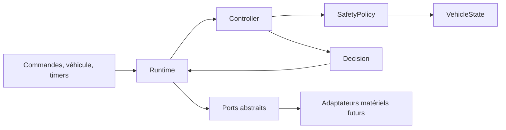
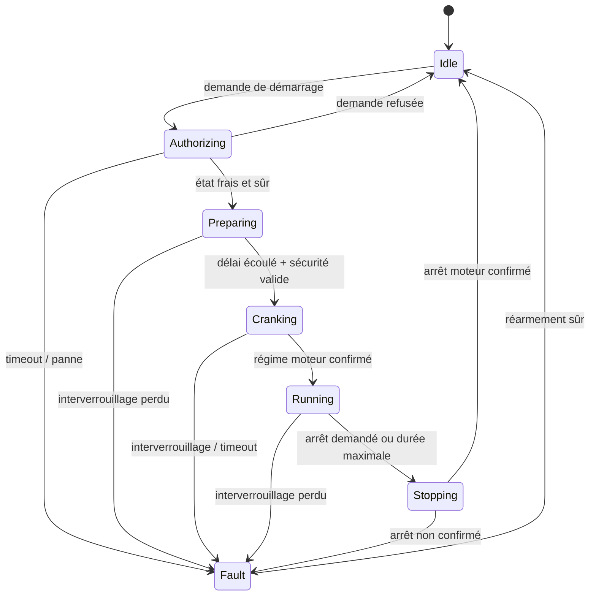

# Architecture logicielle

## Objectif du premier jalon

Le premier jalon fournit un noyau de décision complet, compilable sur ordinateur
et microcontrôleur. Il ne suppose aucun protocole BMW et ne commande aucun
matériel réel. Cette limite est intentionnelle : les décisions de sécurité
peuvent être vérifiées avant de sélectionner un transceiver, une topologie
électrique ou une source de commande distante.

## Règle de dépendance

- **Domaine** : valeurs observées, qualité des signaux, transmission et rapport.
- **Application** : politique de sécurité, machine d'état, événements et actions.
- **Infrastructure** : exécution des actions au travers de ports abstraits.
- **Firmware** : assemblage spécifique à la carte. La version actuelle est
  inerte.

Le domaine et l'application ne dépendent d'aucun framework embarqué.

## Modèle des signaux

Chaque donnée du véhicule est un `Observed<T>` portant une valeur et une qualité :

- `Fresh` : utilisable pour une décision ;
- `Stale` : trop ancienne ;
- `Unavailable` : non reçue ou invalide.

La politique applique une règle fermée par défaut : `Stale` et `Unavailable`
sont toutes deux non sûres. Le calcul de fraîcheur appartient au futur adaptateur
véhicule, car il dépend de la cadence réelle de chaque message.

## Machine d'état

### États

| État | Responsabilité |
|---|---|
| `Idle` | Sorties au repos, attente d'une demande. |
| `Authorizing` | Demande d'un état véhicule frais et évaluation. |
| `Preparing` | Activation abstraite de l'allumage et délai contrôlé. |
| `Cranking` | Commande abstraite du démarreur avec durée maximale. |
| `Running` | Session distante surveillée et limitée dans le temps. |
| `Stopping` | Mise en sécurité des sorties et attente de confirmation. |
| `Fault` | Défaut mémorisé, sorties sécurisées, réarmement contrôlé. |

## Événements et décisions

`Controller::handle()` consomme exactement un événement et le dernier état du
véhicule. Il retourne une `Decision` contenant :

- l'ancien et le nouvel état ;
- le défaut courant ;
- l'évaluation de sécurité ;
- au maximum huit actions ordonnées.

La capacité fixe empêche une allocation mémoire imprévisible. Les actions sont
des intentions telles que `RequestVehicleState`, `EngageStarter`, `SecureOutputs`
ou `ArmTimer` ; elles ne contiennent aucune broche ou trame réseau.

## Exécution fail-safe

`Runtime` exécute les actions via quatre ports :

- `VehicleGateway` ;
- `ActuatorPort` ;
- `TimerPort` ;
- `NotificationSink`.

Si une opération véhicule, actionneur ou minuterie échoue, le runtime injecte un
événement `InfrastructureFailure`. Le contrôleur passe en `Fault` et ordonne
l'annulation du timer, le relâchement du démarreur et la sécurisation globale des
sorties. Le runtime retente ces seules actions de mise en sécurité sans boucle de
récursion.

## Contraintes temporelles

Les valeurs par défaut sont configurables dans `ControllerConfig` :

| Temporisation | Valeur initiale |
|---|---:|
| Réponse d'autorisation | 2 s |
| Préparation avant lancement | 1,5 s |
| Lancement maximal | 5 s |
| Session distante maximale | 15 min |
| Confirmation d'arrêt | 3 s |

Ces valeurs sont des valeurs de développement, pas des paramètres homologués.
Elles devront être qualifiées sur banc et rester bornées dans la configuration de
production.
